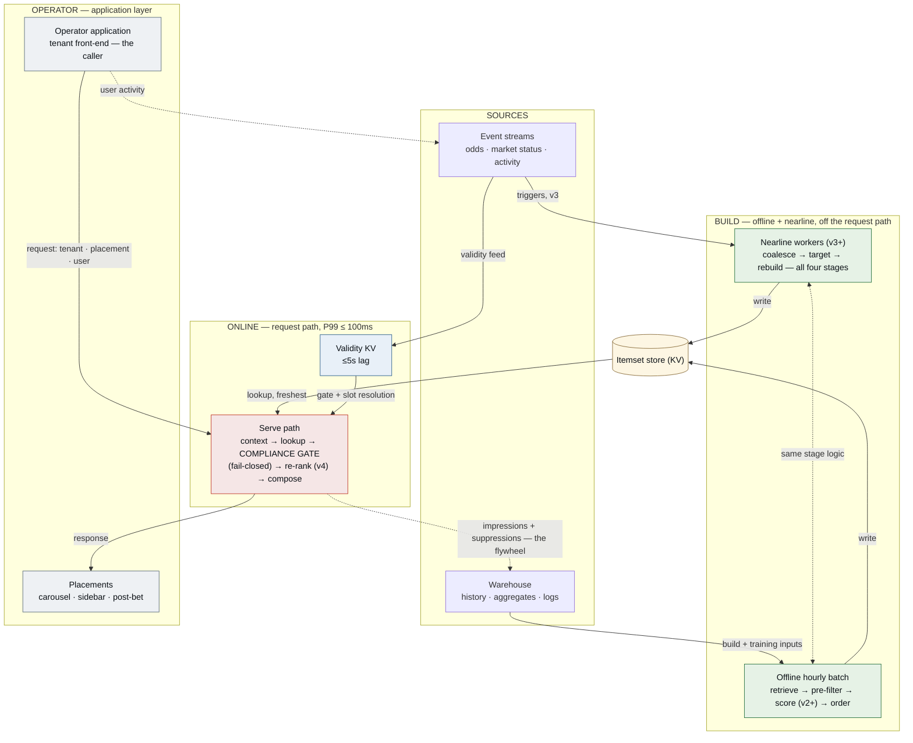

# Recommendation Engine for a HF iGaming Sportsbook — Design Document

The main deliverable. This document answers every topic in the brief directly; depth lives in
ten [ADRs](adr/README.md), terms in the [glossary](GLOSSARY.md), provenance in
[TASKS.md](TASKS.md). Built across several focused sessions with heavy AI-agent collaboration —
my hours went on design decisions and review, the agent's on research, drafting, and the
supporting apps; [sessions/](sessions/2026-07-10-session-1.md) logs the split and ten
corrections where the agent got it wrong.

**The design in one paragraph.** A recommendation is built off the request path and served as a
lookup plus a fail-closed compliance gate. Three execution tiers instead of the classic two,
because "freshness" is two different problems: live market state (odds, suspensions, goals) is
user-independent — one event invalidates many users' lists at once, so it is served by
event-triggered **nearline** recomputation, paid once per event; session intent (what this user
did seconds ago) is the only signal that genuinely needs request-time inference, and arrives
last (v4), behind an experiment gate. A revenue-derived cost ceiling (~€19k/month) makes this
offline-heavy shape a derived necessity, not a taste.

**Interactive companion:** [design explorer](https://nickleomartin.github.io/whizdom-ai-interview/)
(clickable schematic, roadmap morph, storm demo, request trace) ·
[sportsbook UI simulation](https://nickleomartin.github.io/whizdom-ai-interview/prototype/) —
supporting artifacts that convey the design; the document and ADRs are the deliverable.

## 1. Why This Design

The single biggest decision is to split "freshness" into two different problems and refuse to
pay request-time prices for the one that doesn't need them ([ADR-0001](adr/0001-offline-nearline-online-composition.md)).
The rule underneath the whole design: compute is paced by how fast its inputs change, not by how
often its results are read. The classic alternative, "online re-ranks an offline pool", was
rejected because it pays per-request for what nearline pays per-event — roughly ten times the
compute for the same freshness on the market-state layer (the multiple is the number of sidebar
reads per user between market events, derived in [ADR-0001](adr/0001-offline-nearline-online-composition.md));
an online-heavy design was rejected on the cost ceiling ([ADR-0007](adr/0007-cost-model.md)):
~€19k/month buys lookups and CPU re-ranks, not GPU inference at 300 requests per second.

**What I would validate first if building this for real:** the staleness-cost assumption the
whole escalation ladder rests on. v1's logs answer it cheaply with two metrics — CTR decay
versus itemset age, and catalog-coverage staleness (engagement landing on markets born after
the last build) — plus the empirical check on the ~10x multiple itself: sidebar reads per user
per event window, logged from day one. If staleness turns out not to cost engagement, v3 and v4
never get built — which is the point of gating every escalation on evidence.

## 2. The System on One Screen

**What we model** — P(engage | user, item, placement, context) under an RG-constrained utility.
Behaviour decomposes by how fast it changes, and each layer is served by the cheapest tier that
can:

| Behaviour layer | Timescale | Scope | Cheapest infra | Arrives |
|---|---|---|---|---|
| Stable preference (sports, teams, bet types, odds bands) | weeks–months | per-user | warehouse + batch | v1 segment, v2 individual |
| Live market state (availability, odds moves) | seconds–minutes | user-independent | **nearline** — one recompute amortises across all affected users | v3 |
| Session intent (viewed seconds ago) | seconds | per-user, per-moment | **online** — the only layer that needs request-time inference | v4 |
| Causal & sequential effects | cross-session | — | deferred | post-v4 |

**The roadmap** — same four stages (Retrieval → Filtering → Scoring → Ordering,
[ADR-0000](adr/0000-organizing-framework.md)) at every version; only the tier placements evolve,
each escalation gated on evidence that the previous version's limitation costs engagement:

| Stage | v1 | v2 | v3 (nearline) | v4 (online) |
|---|---|---|---|---|
| Retrieval | segment-popularity heuristics | + class-level EASE | + event-triggered refresh | same |
| Filtering | pre-filter @ build + compliance gate @ serve | same | validity flows nearline → gate in seconds | + live session-RG |
| Scoring | none — blend order | GBDT, stored | GBDT re-scored on triggers | GBDT + session features at request time |
| Ordering | static rules | + own-mix calibration | same, nearline | session-aware composition |

## 3. Answers to the Brief

**Requirements & constraints** ([TASKS.md §1–2](TASKS.md) carries the sourced research). Ten
mid-size rev-share tenants → ~14 rps average, 150–300 rps Saturday peak (100k DAU × ~1.5
sessions × ~8 recs). Request rate is *not* the hard problem — **invalidation storms** are: one
goal suspends hundreds of markets across every tenant. Cost ceiling ~€19k/month ≈ €0.55/1k
requests ([ADR-0007](adr/0007-cost-model.md)) — CPU KV+GBDT fits with 3–10x headroom, GPU is
10–50x over. P99 ≤ 100ms serve; validity ≤ 5s; the compliance gate **fails closed** — the one
place availability loses to compliance.

**Offline path** ([ADR-0002](adr/0002-candidate-generation.md), [ADR-0003](adr/0003-ranking-model.md),
[ADR-0008](adr/0008-ordering-stage.md)). Hourly batch runs all four stages: a blend of four
heuristic sources + class-level EASE (v2) assembles 400–600 candidates with merge-proof
promotional tags; slow rules pre-filter before scoring spend; the GBDT scores; six explicit
ordering rules compose. Short-lived in-play markets are stored as **slots** (fixture ×
market-type, late-bound at serve) so builds survive goal-cycle ID churn. Itemsets record model,
feature-set, and rule-pack versions — every served recommendation is reproducible
([stubs/itemset.py](stubs/itemset.py)).

**Nearline path** ([ADR-0001](adr/0001-offline-nearline-online-composition.md) — the
differentiator). A goal is coalesced per fixture; affected users are found by inverted index
and rebuilt in priority order against a bounded budget: active sessions immediately, recent
users as budget allows, dormant never (their next hourly build lands first). The amortisation:
between market events each watching user re-reads the same state ~10 times — per-event pays
once where per-request pays every poll, and the gap peaks exactly when it matters (the goal
that invalidates the itemsets also triggers the refresh storm). This is how storms are absorbed
off the request path ([stubs/nearline_refresh.py](stubs/nearline_refresh.py)).

**Online path** ([stubs/serve_path.py](stubs/serve_path.py)). Six steps inside 100ms: resolve
context → fetch freshest itemset → **compliance gate** (validity, slot resolution, live RG,
rule-pack version drift; every suppression logged with rule ID;
[stubs/compliance_gate.py](stubs/compliance_gate.py)) → optional v4 re-rank (≤30ms, falls back
to the gated order; [stubs/online_reranker.py](stubs/online_reranker.py)) → compose → log the
impression asynchronously. That log *is* the training set — the flywheel.

**Composition — how the tiers work together** ([ADR-0001](adr/0001-offline-nearline-online-composition.md)).
Serving consumes the freshest available itemset, applies the gate, and may re-order within the
gated set. Online **never generates candidates and never overrides the gate**: offline/nearline
own *what can* be recommended; online owns *whether it may be shown right now* and, from v4,
*in what order for this moment*. Degrade chain: re-rank → nearline itemset → stale itemset
(flagged) → segment default — all gated; the gate alone fails closed.

**Modelling choices** ([ADR-0003](adr/0003-ranking-model.md), [ADR-0002](adr/0002-candidate-generation.md)).
One pointwise GBDT, calibrated per item-type × placement (18 isotonic cells) because six item
types compete in one list and an uncalibrated model hands composition to whichever type
inflates. Labels from impressions only (organic exposure has no propensity and carries the
operator UI's bias — organic behaviour feeds *features and retrieval* instead); label =
slip-or-bet, clicks rejected as an RG liability. **Forbidden as positive signals anywhere**:
deposit velocity, loss-recovery, stake escalation. Cold start: segment priors at every level.
Multi-objective trade-offs live in ordering config, not the loss. Explainability is
replay-based from logged features. Item-ID collaborative filtering fails on first principles
here (IDs die in minutes); EASE over stable *classes* is the salvage.

**Responsible Gambling & eligibility** ([ADR-0005](adr/0005-rg-enforcement-point.md)).
Two-point filtering matched to rule speed: jurisdiction rule packs + RG tier at build;
validity + live RG signals + pack-version re-check at serve. Rule packs act at three
granularities straight from the regulatory research — placement (Germany: in-play sidebar off),
market-type, item×user (UK: at-risk users never see promotional content). RG signals are
structurally outside the model's objective — it *cannot* trade compliance for engagement — and
fallback content passes the same gate. One open legal question is flagged, not resolved:
whether recommendations are "marketing" (conservative stance adopted pending compliance review).

**Multi-tenancy** ([ADR-0006](adr/0006-multi-tenancy.md)). One pooled model, siloed data,
tenant-aware features; cross-tenant training is contractual opt-in; tenant behaviour is config
(blend proportions, ordering weights), not code. New tenants get working recommendations day
one from pooled priors; per-tenant eval slices catch cross-tenant contamination.

**Evaluation & feedback loops** ([ADR-0009](adr/0009-evaluation-and-feedback-loops.md)).
Offline: NDCG@placement-K on impressions, recall@pool, two distinct staleness metrics gating
v2→v3, time-based holdouts, SNIPS over dithered logs, every model must beat popularity and an
LR shadow baseline. Online: attributed bet conversion per session (never raw CTR), user-level
whole-week experiments, a permanent 1–2% holdout reading long-term effects. **Success beyond
click-through**: conversion up *while* retention holds, guardrails flat, diversity intact —
engagement bought with escalation is a failed experiment. Four named loop pathologies
(popularity amplification, **chasing losses**, RG-tier exposure collapse, novelty starvation)
each have structural mitigations and a guardrail signal from v1.

## 4. Considered But Not Built — The Bin

Each entry is "wrong for these constraints now", with a revisit trigger — discernment is part
of the deliverable (full research trail: [TASKS.md §5c](TASKS.md)):

| Binned | Why | Revisit when |
|---|---|---|
| LLM-based ranking | Per-request inference 2–3 orders over the €0.55/1k budget; unexplainable rankings fail RG audit | CPU-servable distillations proven in regulated verticals |
| Generative retrieval / semantic IDs | Experimental — lags specialised baselines in Spotify's own study; same cost + audit objections | Production-proven, CPU-servable |
| **Full RL** | Needs logging maturity we lack before v3 — and **exploration in a gambling product is an RG hazard by design** | Only ever the narrow bandit slice, post-v3, gated action space |
| Foundation-model consolidation | Fleet-scale economics vs €19k/month — off by ~3 orders | >100 tenants |
| Two-tower retrieval | Embedding infra to shortlist from ~15k items where five cheap sources already do it | Catalog >100k or blend recall becomes binding |
| Synthetic interaction data | Distribution risk; synthetic gambling behaviour is a regulatory smell | Likely never for interactions |

## 5. How I Used AI Agents

Curated log: [sessions/2026-07-10-session-1.md](sessions/2026-07-10-session-1.md) (raw
tool-call JSONL alongside). **Delegated**: research with sources (pricing benchmarks, recsys
blueprints, RG regulation), ADR drafting from decisions made in review, arithmetic, scaffolding,
the interactive apps. **Kept**: every design-shaping stance, adopt-vs-Bin verdicts, the
catalog-churn insight behind slots, the item-type analysis behind calibration, and the review
passes. **Ten corrections logged**; the sharpest: the agent proposed training on organic
positives with "engagement surface" as a feature — two questions (*how does propensity scoring
work for non-recsys surfaces? isn't the surface feature suspect?*) collapsed it: organic
exposure has no logged propensity, and the surface feature correlated exactly with the
negative-sampling method. The redesign (organic → features; impressions → labels) is now
[ADR-0003](adr/0003-ranking-model.md). Others: a dependency-ordering bug in the decision
sequence, undefined jargon twice (→ [GLOSSARY.md](GLOSSARY.md) + a [CLAUDE.md](CLAUDE.md) style
rule), a missing de-dup policy whose fix surfaced the merge-proof promotional tag, and a
coherence review that caught later ADRs contradicting earlier ones.

## 6. Scoped Out & Next Steps

**Deliberately not covered**: ingestion/stream infrastructure (assumed per the brief); search;
casino cross-sell (regulatorily scoped out); real model training or a runnable pipeline;
per-tenant premium model isolation (upgrade path stated in [ADR-0006](adr/0006-multi-tenancy.md));
exploration beyond seeded dithering (preconditions in [ADR-0009](adr/0009-evaluation-and-feedback-loops.md));
model lifecycle management beyond version-rejection-at-serve (registry, canary, shadow
deployment); the SLO ownership/alerting table; impression-log retention policy (default 90d
hot / 1y cold, pending GDPR review); serve-time lightweight explanations.

**With more time, in order**: (1) validate the staleness-cost assumption on real logs — it
gates everything after v2; (2) pressure-test nearline targeting against recorded Saturday
event bursts; (3) take the "are recommendations marketing?" question to compliance before v1
ships promotional slots; (4) itemset-store layout and cost envelope (back-of-envelope: ~300k
active itemsets × ~5KB ≈ 1.5GB — the open question is layout and version history, not scale);
(5) privacy review of the impression log against GDPR purpose-limitation per tenant contract.
