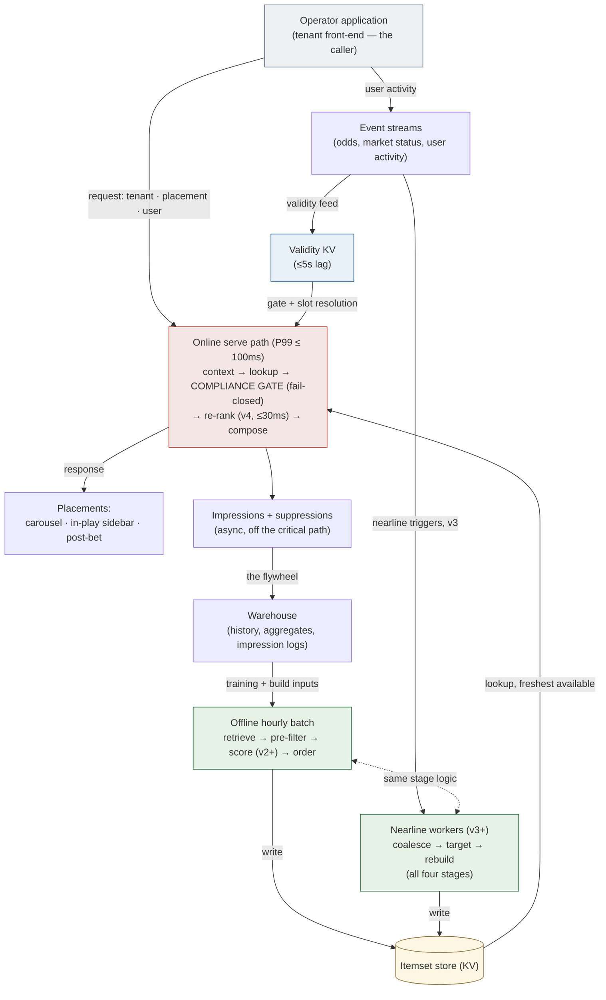

# Recommendation Engine for a HF iGaming Sportsbook — Design Document

The main deliverable. Decisions are recorded in ten ADRs ([index](adr/README.md)); this
document is the narrative synthesis. Coined terms are defined in the [glossary](GLOSSARY.md);
the working document behind everything is [TASKS.md](TASKS.md).

**Contents:**
[1 Why this design](#1-why-this-design) ·
[2 Requirements & assumptions](#2-requirements--assumptions) ·
[3 Mental model](#3-mental-model--what-we-are-modelling) ·
[4 Organizing framework](#4-organizing-framework) ·
[5 Architecture](#5-architecture-overview) ·
[6 Roadmap](#6-evolution-roadmap-v1--v4) ·
[7 Offline](#7-offline-path) ·
[8 Nearline](#8-nearline-path) ·
[9 Online](#9-online-path) ·
[10 Composition](#10-composition--how-the-tiers-work-together) ·
[11 Modelling](#11-modelling-choices) ·
[12 Multi-tenancy](#12-multi-tenancy) ·
[13 RG & eligibility](#13-responsible-gambling--eligibility) ·
[14 Evaluation](#14-evaluation) ·
[15 The Bin](#15-considered-but-not-built--the-bin) ·
[16 AI agents](#16-how-i-used-ai-agents) ·
[17 Scoped out](#17-scoped-out--next-steps)

## 1. Why This Design

The single biggest decision is to split "freshness" into two different problems and refuse to
pay request-time prices for the one that doesn't need them ([ADR-0001](adr/0001-offline-nearline-online-composition.md)).
The rule underneath the whole design: compute is paced by how fast its inputs change, not by how
often its results are read.
Live market state — odds moves, suspensions, goals — is user-independent: one event invalidates
many users' recommendations at once, so it is served by **event-triggered nearline recomputation**
(one recompute amortised across every affected user, serving stays a cheap lookup). Only session
intent — what *this* user did seconds ago — genuinely requires request-time inference, and it is
deferred to v4 behind an experiment gate. The classic alternative, "online re-ranks an offline
pool", was rejected because it pays per-request for what nearline pays per-event — roughly ten
times the compute for the same freshness on the market-state layer (the multiple is the number
of sidebar reads per user between market events — derived in [ADR-0001](adr/0001-offline-nearline-online-composition.md)); an online-heavy design was
rejected on the cost ceiling ([ADR-0007](adr/0007-cost-model.md)): ~€19k/month platform-wide
buys lookups and CPU re-ranks, not GPU inference at 300 requests per second.

**What I would validate first if building this for real:** the staleness-cost assumption that
the entire escalation ladder rests on. v1's logs answer it cheaply with two metrics — CTR decay
versus itemset age (do rankings go stale?) and catalog-coverage staleness (how much live
engagement lands on markets born after the last build?). If staleness turns out not to cost
engagement, v3 and v4 never get built and the design stops at a much cheaper system — which is
the point of gating every escalation on evidence.

## 2. Requirements & Assumptions

**In one line:** ten cost-sensitive tenants, ~14 rps average with 10–20x event-driven peaks, a €19k/month ceiling, and placement-level regulatory constraints — these numbers shape every decision below.

**Functional.** Recommend relevant items per user across three placements (homepage carousel,
in-play sidebar, post-bet suggestions). Items span six types — events, markets, selections,
bet-builder/SGP combos, accumulators, boosts — competing in one mixed ranked list per placement,
which makes cross-type score comparability a hard requirement ([ADR-0003](adr/0003-ranking-model.md)).
Offline and online paths must compose, and Responsible Gambling plus per-jurisdiction
eligibility are hard constraints, not preferences.

**Non-functional (decided).** P99 ≤ 100ms end-to-end serve; the v4 re-rank capped at 30ms with
fallback on breach. Itemsets rebuild hourly; the market-validity lookup lags the stream by at
most 5 seconds so a suspended market never surfaces. Availability follows a degrade chain that
never serves an empty response — with one deliberate exception: **the compliance gate fails
closed**. If it cannot evaluate, nothing is served. Compliance outranks availability.

**Throughput, derived.** Ten tenants × 50k MAU → ~100k DAU → ~1.2M requests/day ≈ **14 rps
average**. Sportsbook traffic is violently event-concentrated: **150–300 rps sustained peak**
(Saturday kickoffs), with burst storms on live events. The derivation's punchline: request rate
is *not* the hard problem — CPU serves 300 rps trivially. The hard problem is **invalidation
storms**: one goal suspends hundreds of markets across all tenants simultaneously. The
architecture is shaped around that fact.

**Business context, researched.** ~10 mid-size operator tenants (each ~€1–5M GGR/month —
revenue-share customers below the enterprise-licence threshold). Platform take ~10% of GGR;
infra ≤15% of platform revenue; recsys ≤5% of infra → **~€19k/month platform-wide ≈ €0.55 per
thousand requests** ([ADR-0007](adr/0007-cost-model.md), sources therein). A KV lookup plus CPU
GBDT costs €0.05–0.20 per thousand — fits with 3–10x headroom. GPU serving is 10–50x that and
does not fit. This is *why* the architecture is offline-heavy: cost, not just latency.

**Key data assumptions** (full list in [TASKS.md §2](TASKS.md)): catalog of ~10–20k active
markets (thousands, not millions); in-play micro-markets are born and die in minutes — market
IDs are recreated after every goal, which forces the slot representation
([ADR-0002](adr/0002-candidate-generation.md)); ~30% of MAU are sparse (<5 lifetime bets); the
RG risk tier is consumed from upstream (regulators mandate automated harm detection, so the
platform must already produce it); upstream event streams and warehouse exist per the brief.

**Regulatory grounding** (researched, sources in [TASKS.md §2](TASKS.md)): self-exclusion
registries (GAMSTOP, OASIS, Spelpaus, CRUKS) gate users before the recommender ever sees them;
Germany's in-play restrictions make **eligibility placement-level**, not just item-level — the
in-play sidebar is effectively off for German users; the UK bans cross-product promotion
(scoping the recommender to sportsbook-only) and requires suppressing marketing to at-risk
customers. One open legal question is flagged rather than resolved: whether recommendations
constitute "marketing" varies by jurisdiction and presentation — the conservative stance
(promotional-styled recommendations are marketing: consent-gated, at-risk-suppressed) is
adopted pending compliance review.

## 3. Mental Model — What We Are Modelling

**In one line:** behaviour splits into layers by how fast it changes and who it belongs to; each layer is served by the cheapest tier that can.

Sportsbook user behaviour decomposes into layers, each with a
cheapest-infrastructure-that-serves-it answer. The core modelling target is
**P(engage | user, item, placement, context)**, shaped by a utility that respects RG
constraints — never maximising engagement for at-risk users.

| Behaviour layer | Timescale | Scope | Cheapest infra that serves it | Captured in |
|---|---|---|---|---|
| **Stable preference** (sports, leagues, teams, bet types, odds bands) | Weeks–months | Per-user | Warehouse + batch | v1 (segment), v2 (individual) |
| **Live market state** (what's live, odds moves, availability) | Seconds–minutes | User-independent | **Nearline** — one event-triggered recompute amortises across all affected users | v3 |
| **Session intent** (viewed seconds ago, just bet) | Seconds | Per-user, per-moment | **Online** — the only layer that genuinely needs request-time inference | v4 |
| **Causal & sequential effects** (incrementality, exploration) | Cross-session | — | Deferred | Post-v4 |

The market-state/session-intent split is what justifies nearline as its own version: most of
the freshness value lands *before* paying request-time serving costs. Why live market state
matters so much here: in-play is the majority of volume in a mature book, and availability
changes in seconds — a stale recommendation is not merely suboptimal, it is *broken* (a
suspended market surfaced to a user).

## 4. Organizing Framework

**In one line:** four stages say *what* the work is, three tiers say *where* it runs — every component has a grid address.

The design is decomposed on a two-axis grid ([ADR-0000](adr/0000-organizing-framework.md)):
**four stages** say what the work is — Retrieval → Filtering → Scoring → Ordering (the NVIDIA
Merlin pattern, with Amatriain's amendment that filtering runs at two points) — and **three
execution tiers** say where it runs: offline (scheduled batch), nearline (event-triggered, off
the request path), online (request-time). The assessment's own topic vocabulary (offline path,
online path, composition…) remains the reader-facing organisation of this document; ADR-0000
carries the translation table mapping each topic to its owning decision records.

## 5. Architecture Overview

**In one line:** build itemsets off the request path, serve them as lookups, gate everything at the door.

> **[Explore this schematic interactively →](https://nickleomartin.github.io/whizdom-ai-interview/)**
> — clickable modules with config surfaces, the v1→v4 roadmap morph, the invalidation-storm
> demo, and a per-persona request trace.

Serving is always a lookup plus the compliance gate, at every version. The online tier never
generates candidates and never overrides the gate. Degrade chain: online re-rank → nearline
itemset → stale itemset (flagged) → segment-popularity default — every step still passing the
gate; the gate itself is the one component that fails closed rather than degrading. The loop
starts and ends outside the system boundary: the operator's application calls the serve path
per placement render and originates the user-activity events that feed the streams.

## 6. Evolution Roadmap (v1 → v4)

**In one line:** four versions; each escalation is built only after evidence that the previous version's staleness actually costs engagement.

The delivery strategy, not a one-shot end state: freshness escalates in cost order — batch →
nearline → online — and each escalation must pass an experiment gate showing the previous
version's limitation actually costs engagement.

| Stage | v1 | v2 | v3 (nearline) | v4 (online) |
|---|---|---|---|---|
| Retrieval | Popularity-by-segment heuristics (offline) | + class-level EASE source | + event-triggered candidate refresh (nearline) | same |
| Filtering | Eligibility pre-filter at build + compliance gate at serve | same | validity flows nearline → gate KV in seconds | + live session-RG signals |
| Scoring | none — blend order | GBDT, scores stored (offline) | GBDT re-scored nearline on triggers | GBDT re-scored at request time with session features |
| Ordering | Static rules (offline) | + calibration to user's own mix | same, recomputed nearline | request-time session-aware composition |

**v1 — heuristic baseline + measurement harness** *(stable preference, segment-level)*. The
point of v1 is the infrastructure to learn: impression logging with positions and propensities,
the evaluation harness, the A/B framework. Gate to v2: baseline stable, logging validated,
guardrails wired. **v2 — learned ranking** *(individual-level)*: the GBDT + calibration, EASE
joins the blend. Gate to v3: v2 beats v1 without guardrail regression AND staleness shown
binding. **v3 — nearline refresh** *(adds live market state)*: goal → affected itemsets rebuilt
within a minute; serving unchanged. Gate to v4: residual staleness is session-intent-shaped,
not market-state-shaped. **v4 — request-time re-ranking** *(adds session intent)*: only the
genuinely per-user-per-moment layer pays request-time cost. **Later, deliberately deferred**:
contextual bandits, incrementality, two-tower retrieval, per-tenant fine-tuning.

The event stream enters in v1 in a minimal, dumb form (the validity bitmap), becomes a trigger
source at v3, and a feature source only at v4 — stream infrastructure investment is
incremental, matching proven value (data-source matrix in [TASKS.md §7](TASKS.md)).

## 7. Offline Path

**In one line:** the hourly batch runs all four stages and stores versioned, slot-based itemsets; flagging staleness and enforcing validity are deliberately separate jobs.

The hourly batch (v1 may start nightly) builds itemsets per user or segment, running all four
stages in sequence:

- **Retrieval** assembles 400–600 unique candidates from named sources — user affinity, segment
  popularity, starting-soon/live slots, tenant promotions, and from v2 the EASE class-affinity
  source — de-duplicated on a canonical key with kept provenance and a merge-proof promotional
  tag ([ADR-0002](adr/0002-candidate-generation.md)).
- **The eligibility pre-filter** applies slow-moving rule packs before anything is scored
  ([ADR-0005](adr/0005-rg-enforcement-point.md)) — never spending compute on what may never be shown.
- **Scoring** applies the calibrated GBDT from v2 ([ADR-0003](adr/0003-ranking-model.md)).
- **Ordering** composes the final list under six explicit rules ([ADR-0008](adr/0008-ordering-stage.md)).

**The stored artifact** ([stubs/itemset.py](stubs/itemset.py)) records the model, feature-set,
and rule-pack versions it was built under, making every served recommendation reproducible.
Short-lived market classes are stored as **slots** (fixture × market type) late-bound to live
market IDs at serve, so batch builds survive the goal-cycle ID churn.

**Staleness is a division of labour**: the TTL only *flags* stale itemsets; validity is the
gate's job on every request; and the batch job fails closed on evaluation-metric regression —
stale itemsets keep serving rather than a bad build going live.

## 8. Nearline Path

**In one line:** one market event recomputes many users' itemsets once, off the request path — with a priority policy that keeps Saturday storms survivable.

The middle tier, arriving at v3 ([ADR-0001](adr/0001-offline-nearline-online-composition.md);
contract in [stubs/nearline_refresh.py](stubs/nearline_refresh.py)). A market event — goal,
suspension, large odds swing — is coalesced per fixture (one goal emits dozens of correlated
market events; they collapse into one recompute per affected user), affected users are found by
index (itemsets are keyed by the fixtures and slots they contain), and rebuilt in priority
order against a bounded worker budget.

**The amortisation arithmetic** (derived in [ADR-0001](adr/0001-offline-nearline-online-composition.md)):
the stage logic is identical in both paths, so the cost comparison reduces to *reads per user
between market events* — an open sidebar polls far more often than a live fixture produces a
material event, roughly ten reads per event window. Per-request re-ranking recomputes an
identical answer on every poll because nothing changed between them; per-event recomputation
pays once. That is the ~10x in §1, it is binding against the €0.55/1k ceiling rather than
stylistic, and it is at its worst exactly when it matters most — reads and events peak
together, because the goal that invalidates the itemsets also triggers the refresh storm.

**Where this departs from the Netflix blueprint — and why targeting is load-bearing.** In the
original three-tier blueprint, nearline work is per-user: one user's event updates that user's
state, fan-out of one. Here the trigger is a *market* event whose fan-out is every user holding
that fixture — on a big match, a large share of all active users at once. The naive reading of
"nearline" would melt on a Saturday. The targeting policy is therefore not an optimisation but
the thing that makes the tier viable: recompute active-session users immediately (they can see
the staleness), recently-active users as budget allows, dormant users never — their next hourly
build lands before they return. If the budget saturates, the middle priority degrades toward
batch cadence while active sessions hold, and the validity KV keeps every user safe from
suspended markets regardless of recompute tier. At v3 the model artifact is unchanged; a
rebuild changes the candidate set and the nearline-refreshed aggregates. This tier is how
invalidation storms are absorbed off the request path: the serving path never gets busier
because the match got exciting.

## 9. Online Path

**In one line:** serving is a lookup, a fail-closed compliance gate, and (from v4) a budget-boxed re-rank — logging every impression it serves.

The serve path ([stubs/serve_path.py](stubs/serve_path.py)) runs six steps inside the P99 ≤
100ms budget:

1. **Resolve user context** — jurisdiction, consent flags, RG tier; all consumed from platform
   services, none derived here.
2. **Fetch the freshest itemset** — the nearline refresh if one exists, otherwise the last
   batch build.
3. **Compliance gate** ([stubs/compliance_gate.py](stubs/compliance_gate.py)) — market validity
   at ≤5s lag, slot resolution, live RG signals, and a rule-pack version-drift check.
   Fail-closed; every suppression logged with its rule ID.
4. **Optional re-rank** (v4 only, [stubs/online_reranker.py](stubs/online_reranker.py)) —
   session features under a hard 30ms budget, falling back to the gated order on breach.
5. **Compose and respond.**
6. **Log the impression** — exact feature values, position, and propensity, asynchronously.
   That log *is* the training set and the counterfactual-evaluation input — the system's flywheel.

## 10. Composition — How the Tiers Work Together

**In one line:** offline and nearline decide *what can* be recommended; online decides *whether it may* be shown right now and, from v4, *in what order* for this moment.

The contract ([ADR-0001](adr/0001-offline-nearline-online-composition.md)): serving consumes
the freshest available itemset, applies the gate, and may re-order within the gated set. The
online tier **never generates candidates and never overrides the gate** — online freshness is
opt-in per version, bounded, and always has a precomputed fallback. This answers the brief's
composition question directly: online neither merely filters nor overrides the offline output —
the offline/nearline tiers own *what* can be recommended; the online tier owns *whether it may
be shown right now* (gate) and, from v4, *in what order for this moment* (re-rank). Fallback
behaviour is a stated chain with the compliance gate as the single fail-closed exception.

## 11. Modelling Choices

**In one line:** deliberately light retrieval, one calibrated GBDT at every tier, impression-only labels, and an explicit forbidden-signals list.

**Retrieval** ([ADR-0002](adr/0002-candidate-generation.md)): deliberately light — at 10–20k
active markets, retrieval must justify existing before justifying being clever. Four heuristic
sources plus one learned one (EASE over stable item *classes*, not market IDs — item-ID
collaborative filtering fails on first principles here because the IDs don't live long enough
to accumulate co-occurrence signal). No embedding model, no ANN index, at any version.

**Ranking** ([ADR-0003](adr/0003-ranking-model.md)): one pointwise GBDT predicting calibrated
P(engage), introduced at v2, used at all tiers with whatever feature groups the tier provides.
The label is slip-or-bet (bet-weighted) — raw clicks rejected because click-optimised ranking
is an RG liability in this domain. Training data: **organic behaviour feeds features and
retrieval; impressions feed labels** — organic exposure has no logged propensity and carries
the operator UI's own bias, so it cannot be label material; impressions provide the only true
negatives. Calibration is load-bearing: isotonic per item-type × placement (18 cells,
hierarchical fallback), because six item types compete in one list and an uncalibrated model
silently hands composition to whichever type inflates. Cross-type comparability is why
pointwise-plus-calibration beat pairwise learning-to-rank. Explainability is replay-based:
every impression logs its feature values and model version, so any past prediction can be
deterministically replayed with attributions when a case is flagged.

**Cold start**: segment priors at every level — sparse users get segment popularity, new
tenants get the pooled model with segment-initialised tenant features
([ADR-0006](adr/0006-multi-tenancy.md)), anonymous users get segment defaults only (identity
is required for jurisdiction and RG checks anyway).

**Heterogeneous signals**: the ladder is explicit — odds views are features, kept slip-adds are
labels at weight 1, placed bets anchor at weight 3, quickly-removed slips are excluded as
ambiguous, cash-outs are RG-monitoring inputs, and **deposit velocity, loss-recovery and stake
escalation are forbidden as positive signals anywhere** — a model that learns "users chasing
losses engage more" is the pathology this design exists to prevent.

**Multi-objective**: composed at ordering with inspectable config weights, not baked into an
opaque training target; long-term effects are measured (permanent 1–2% holdout) before anything
optimises for them.

## 12. Multi-Tenancy

**In one line:** one pooled model, siloed data, tenant behaviour expressed as configuration.

One pooled model, siloed data, tenant-aware features
([ADR-0006](adr/0006-multi-tenancy.md)). Raw interaction data stays in per-tenant warehouse
namespaces; cross-tenant training is contractual opt-in; tenant-specific behaviour is expressed
through features and configuration (blend proportions, ordering rules, placement setup) rather
than separate models. New tenants get working recommendations from day one via pooled priors —
the B2B pitch depends on it. The evaluation harness reports per-tenant slices so one tenant's
data cannot silently degrade another's quality. Per-tenant model isolation is a deliberate
non-goal for ten tenants, with a stated upgrade path (tenant features → per-tenant fine-tuning)
if a premium tier ever demands it.

## 13. Responsible Gambling & Eligibility

**In one line:** two filter points matched to rule speed; the gate fails closed; the model is structurally unable to trade compliance for engagement.

Two-point filtering ([ADR-0005](adr/0005-rg-enforcement-point.md)), speed-matched: the
**eligibility pre-filter** applies slow-moving jurisdiction rule packs and RG-tier restrictions
at build time (never scoring what may never be shown); the **compliance gate** applies
fast-moving state at serve time — market validity, live RG signals, and a rule-pack version
check that re-applies current rules if they changed since the build. Rule packs operate at
three granularities, directly reflecting the regulatory research: placement (Germany: in-play
sidebar off), market-type (banned live-betting classes), and item×user (at-risk users never see
promotional content; UK cross-product rules). The gate fails closed, every suppression is
logged with its rule ID and pack version, and RG signals are structurally outside the ranking
model's objective — the model *cannot* trade compliance against engagement. Fallback content
passes the same gate; there is no back door through degradation.

## 14. Evaluation

**In one line:** success = conversion up *while* retention holds, guardrails flat, diversity intact — anything else fails, whatever the primary metric says.

Owned by [ADR-0009](adr/0009-evaluation-and-feedback-loops.md) in full; the shape:

**Offline**: NDCG@K per placement (K = the placement's list size) on recsys-surface impressions;
recall@pool to separate retrieval misses from ranking failures; two deliberately distinct
staleness metrics — CTR decay vs itemset age, and catalog-coverage staleness (engagement on
markets born after the last build) — jointly gating the v2→v3 escalation; time-based holdouts
only; SNIPS counterfactual estimation over the dithered logs from v2; every model must beat
segment popularity and a logistic-regression shadow baseline before any A/B.

**Online**: primary metric is attributed bet conversion per session (CTR explicitly rejected);
user-level randomisation stratified per tenant (session-level violates SUTVA here); whole-week
experiments, minimum two weekend cycles (the traffic is violently weekly-seasonal); a permanent
1–2% holdout cohort reads long-term retention effects over months.

**Success beyond click-through**: a variant succeeds if conversion rises *while* retention
holds, guardrails stay flat, and diversity does not collapse. Engagement bought with
escalation, popularity collapse, or RG-tier neglect is a failed experiment even when the
primary metric wins.

**Feedback-loop pathologies** — the domain-specific ones, each with structural mitigations and
a guardrail signal from v1: popularity-bias amplification (diversity caps, own-mix calibration,
dithering; Gini of impressions), **chasing losses** (forbidden signals + odds-band exposure
anchored to the user's long-run profile; odds-band drift on losing-streak cohorts, alerts
routed to RG monitoring), RG-tier exposure collapse (RG signals outside the model; coverage
parity per tier), novelty starvation (new-item floor, nearline refresh, slots; itemset age
distribution). Drift monitoring runs continuously: feature PSI, per-cell calibration drift,
pool composition shares, per-tenant performance trends.

## 15. Considered But Not Built + The Bin

**In one line:** the fashionable approaches were researched, costed, and binned with explicit revisit triggers — discernment is part of the deliverable.

The offline/online contract, freshness handling, and pathology treatment above were designed
but not implemented — per the brief. Beyond those, researched approaches were explicitly
rejected or deferred, each with a reason and a revisit trigger (full table in
[TASKS.md §5c](TASKS.md)). Highlights:

| Binned | Why | Revisit when |
|---|---|---|
| Generative retrieval / semantic IDs / LLM rankers | Experimental (Spotify's own study: lags specialised baselines); GPU cost breaks [ADR-0007](adr/0007-cost-model.md); unexplainable ranking fails RG audit | Production-proven in regulated verticals, CPU-servable |
| **Full RL** | Needs logging maturity we won't have before v3 — and **exploration in a gambling product is an RG hazard by design** | Only ever the narrow bandit slice, post-v3, RG-safe action space |
| Foundation-model consolidation | Fleet-scale economics vs €19k/month — off by ~3 orders of magnitude | >100 tenants |
| Two-tower retrieval | Embedding infra to shortlist from thousands where four queries already do it | Catalog >100k or measured recall becomes binding |
| Synthetic interaction data | Distribution risk + synthetic gambling behaviour is a regulatory smell | Likely never for interactions |

A Bin entry is not "bad idea" — it is "wrong for these constraints now", with an explicit
trigger. The discernment is part of the deliverable.

## 16. How I Used AI Agents

**In one line:** the agent did research and drafting; the judgement calls — and ten logged corrections of the agent — were mine.

Full curated log with the raw tool-call JSONL in [sessions/](sessions/); the honest summary:

**Delegated to Claude Code**: structuring the brief into a decision checklist; sourced web
research (B2B pricing benchmarks, recsys architecture blueprints, per-jurisdiction RG
regulation); drafting all ten ADRs from decision shapes worked out in review; the cost and
throughput arithmetic; repo scaffolding and this document's synthesis.

**Kept for myself**: every design-shaping stance (evolutionary roadmap over one-shot;
multi-tenancy and cost as first-order constraints); adopt-vs-Bin verdicts on every researched
pattern; the catalog-churn insight that produced the slot representation; the item-type
analysis behind the calibration requirement; and the review passes that repeatedly changed the
design.

**Where the agent got it wrong and how it was caught** (ten corrections logged; the sharpest):
the agent proposed training the ranker on organic positives with "engagement surface" as a
feature. Two questions — *how does propensity scoring work for non-recsys surfaces?* and *isn't
the surface feature suspect?* — collapsed the design: organic exposure has no logged propensity
(and the agent's "exposure-independent" claim was overstated), and the surface feature
correlated exactly with the negative-sampling method, so it would have absorbed a sampling
artifact. The redesign (organic → features; impressions → labels) is now
[ADR-0003](adr/0003-ranking-model.md). Other corrections: a dependency-ordering bug in the
decision sequence, undefined jargon twice (fixed with [GLOSSARY.md](GLOSSARY.md) and a CLAUDE.md
style rule), a missing de-duplication policy whose fix surfaced a real RG edge case
(merge-proof promotional tags), and a full-set coherence review that caught later ADRs
contradicting earlier ones.

## 17. Scoped Out & Next Steps

**In one line:** what was deliberately left out, and the five things to do first with more time.

**Deliberately not covered**: ingestion and stream infrastructure (assumed per the brief);
search and any unified search-rec model (not our surface); casino cross-sell (regulatorily
scoped out); real model training and a runnable pipeline (explicitly out of scope); per-tenant
premium model isolation (upgrade path stated, not built); exploration beyond seeded dithering
(preconditions stated in [ADR-0009](adr/0009-evaluation-and-feedback-loops.md)).

**With more time, in order**: (1) validate the staleness-cost assumption on real logs — it
gates everything after v2; (2) pressure-test the nearline targeting policy against recorded
Saturday event bursts (the invalidation-storm worst case); (3) take the "are recommendations
marketing?" question to compliance before v1 ships promotional slots; (4) design the itemset
store's storage layout and cost envelope in detail (the one infrastructure component this
design leans on hardest); (5) a privacy review of the impression log against GDPR
purpose-limitation, per tenant contract.
